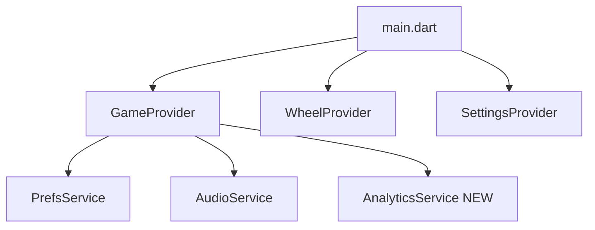

# SFLS — План доработок

## Архитектура: что меняется глобально



---

## Блок 1 — AppMetrica

**Что делаем:** создаём `lib/services/analytics_service.dart` — синглтон-обёртку над `appmetrica_sdk`.

**Изменения:**
- `pubspec.yaml` — добавить `appmetrica_sdk`
- `lib/services/analytics_service.dart` (создать) — методы: `gameStart`, `gameWin`, `gameLoss`, `betChange`, `paywallView`, `paywallClose`, `purchaseClick`, `purchaseSuccess`, `purchaseError`, `settingsOpen`, `appClose`
- `lib/main.dart` — инициализировать AppMetrica (ключ из `constants.dart`)
- `lib/core/constants.dart` — добавить `appMetricaKey`
- Вызовы в: `GameProvider` (game_start/win/loss/bet_change), `ShopScreen` (paywall_*), `ShopProvider` (purchase_*), `SettingsScreen` (settings_open)

**Формат событий** (по `specs/metrics.md`):
```dart
AppMetrica.reportEventWithMap('game_win', {'spin_foot_lucky_star': {'game_name': 'crash'}});
```

---

## Блок 2 — start.io Rewarded Ads

**Что делаем:** создаём `lib/services/ad_service.dart` — синглтон для загрузки и показа rewarded-видео. Баннер и интерстишл — не используем.

**Изменения:**
- `pubspec.yaml` — добавить start.io SDK (по документации `specs/adv.md`)
- `lib/services/ad_service.dart` (создать) — `loadRewarded()`, `showRewarded({onRewarded})`, геттер `isReady`
- `lib/main.dart` — инициализировать AdService (ID `205713239`)

**Три точки интеграции рекламы:**

1. **Shop — Free Coins (1000 монет за видео):** кнопка в `ShopScreen`, вызывает `AdService.showRewarded` → `GameProvider.addToBalance(1000)`
2. **Wheel — Watch & Claim:** после остановки колеса вместо автоматического зачисления показываем кнопку "Watch & Claim" (пульсирует) → видео → `WheelProvider.onSpinComplete()`
3. **Game — Boost Reward после победы:** в `ResultOverlayWidget` при `cashedOut` показываем кнопку "Boost Reward" 2 сек → мини-колесо 1.5с (иксы x1–x10) → "Claim!" → видео → `GameProvider.addToBalance(бонус)`

---

## Блок 3 — Settings: исправления

**Звук и музыка — через ползунки (как сейчас), без свитчеров вкл/выкл**

Текущая реализация уже корректна: `SoundCard` содержит два `VolumeSlider` (Sound / Music), `SettingsProvider` управляет `soundVolume` и `musicVolume`, `AudioService` применяет громкость к `_fxPlayer` / `_spinPlayer` и `_bgPlayer`. Отключение звука — через громкость `0`, отдельные `soundEnabled` / `fxEnabled` не нужны.

**Что проверить / доделать:**
- Убедиться, что `AudioService` не воспроизводит FX при `soundVolume == 0` и не играет музыку при `musicVolume == 0` (сейчас громкость применяется, но вызовы `playWin` / `playLose` / `playSpin` / `playBackground` не проверяют нулевую громкость — добавить early return)
- Удалить неиспользуемые `soundEnabled` / `fxEnabled` из `PrefsService`, если они нигде не задействованы
- `SettingsProvider` и `SoundCard` — без изменений, ползунки остаются

**Notifications — заглушка**

- `lib/features/settings/widgets/toggle_card.dart` — подключить реальный toggle, сохранять в `PrefsService` (добавить `notificationsEnabled`)

**Terms/Privacy в Settings**

- `lib/features/settings/settings_screen.dart` — добавить две строки-ссылки внизу через `url_launcher`
- `lib/core/constants.dart` — заменить `example.com` на реальные URL Telegraph

---

## Блок 4 — Wheel: исправления

**Проблема 1: нет пульсации + нет "Tap"**

- `lib/features/wheel/widgets/spin_button.dart` — добавить `AnimationController` с `repeat(reverse: true)` для scale-пульсации; добавить текст "Tap" под кнопкой

**Проблема 2: Watch & Claim flow (реклама перед зачислением)**

- `lib/features/wheel/wheel_screen.dart` — после `_onAnimationStatus` не вызывать `onSpinComplete` сразу; вместо этого показывать overlay-кнопку "Watch & Claim" (пульсирует)
- По нажатию: `AdService.showRewarded` → в колбэке `onRewarded` → `WheelProvider.onSpinComplete(gameProvider)`

---

## Блок 5 — Game: Boost Reward после победы

**Изменения в:**
- `lib/shared/widgets/result_overlay_widget.dart` — при `cashedOut` добавить кнопку "Boost Reward" (показывается 2 сек, пульсирует)
- Новый файл `lib/features/game/widgets/boost_reward_overlay.dart` — мини-колесо x1–x10 (1.5с анимация), затем итоговый экран с суммой и "Claim!" → `AdService.showRewarded` → `GameProvider.addToBalance(бонус)`

---

## Блок 6 — Terms / Privacy URLs

- `lib/core/constants.dart` — заменить `termsUrl` и `privacyUrl` на реальные ссылки Telegraph (по шаблону из `specs/common_spec.md`)
- Убедиться, что `url_launcher` вызывается в: `LetsPlayScreen`, `ShopScreen`, `SettingsScreen`

---

## Блок 7 — Cleanup

- Удалить или переиспользовать orphaned виджеты: `bet_panel_widget.dart`, `wheel_timer_widget.dart`, `multiplier_display.dart`, `potential_win_label.dart`
- `lib/main.dart` — удалить `DevicePreview` из production-сборки (уже обёрнут в `kDebugMode`, но импорт в prod-коде)
- Поднять версию в `pubspec.yaml`

---

## Порядок реализации (рекомендуемый)

1. AppMetrica (фундамент — логировать с самого начала)
2. Settings исправления (быстро, независимо)
3. Terms/Privacy URLs
4. start.io AdService
5. Wheel: Watch & Claim + пульсация
6. Game: Boost Reward overlay
7. Cleanup + версия
