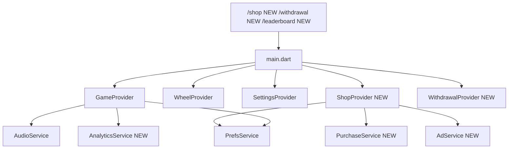

# SFLS — План доработок

## Архитектура: что меняется глобально



---

## Блок 1 — AppMetrica

**Что делаем:** создаём `lib/services/analytics_service.dart` — синглтон-обёртку над `appmetrica_sdk`.

**Изменения:**
- `pubspec.yaml` — добавить `appmetrica_sdk`
- `lib/services/analytics_service.dart` (создать) — методы: `gameStart`, `gameWin`, `gameLoss`, `betChange`, `paywallView`, `paywallClose`, `purchaseClick`, `purchaseSuccess`, `purchaseError`, `settingsOpen`, `appClose`
- `lib/main.dart` — инициализировать AppMetrica (ключ из `constants.dart`)
- `lib/core/constants.dart` — добавить `appMetricaKey`
- Вызовы в: `GameProvider` (game_start/win/loss/bet_change), `ShopScreen` (paywall_*), `ShopProvider` (purchase_*), `SettingsScreen` (settings_open)

**Формат событий** (по `specs/metrics.md`):
```dart
AppMetrica.reportEventWithMap('game_win', {'spin_foot_lucky_star': {'game_name': 'crash'}});
```

---

## Блок 2 — start.io Rewarded Ads

**Что делаем:** создаём `lib/services/ad_service.dart` — синглтон для загрузки и показа rewarded-видео. Баннер и интерстишл — не используем.

**Изменения:**
- `pubspec.yaml` — добавить start.io SDK (по документации `specs/adv.md`)
- `lib/services/ad_service.dart` (создать) — `loadRewarded()`, `showRewarded({onRewarded})`, геттер `isReady`
- `lib/main.dart` — инициализировать AdService (ID `205713239`)

**Три точки интеграции рекламы:**

1. **Shop — Free Coins (1000 монет за видео):** кнопка в `ShopScreen`, вызывает `AdService.showRewarded` → `GameProvider.addToBalance(1000)`
2. **Wheel — Watch & Claim:** после остановки колеса вместо автоматического зачисления показываем кнопку "Watch & Claim" (пульсирует) → видео → `WheelProvider.onSpinComplete()`
3. **Game — Boost Reward после победы:** в `ResultOverlayWidget` при `cashedOut` показываем кнопку "Boost Reward" 2 сек → мини-колесо 1.5с (иксы x1–x10) → "Claim!" → видео → `GameProvider.addToBalance(бонус)`

---

## Блок 3 — Shop Screen

**Новые файлы:**
- `lib/features/shop/shop_screen.dart`
- `lib/features/shop/shop_provider.dart`
- `lib/services/purchase_service.dart`

**ShopProvider:**
- Методы: `buyPack(packId)` → через `PurchaseService` → при успехе: `addCoins`, `addFreeSpins`, `setBonusPercent`, `setBonusExpiry`
- 3 пакета (не-белая прила по `AGENT.md`): Starter $2.99 / Premium $5.99 / VIP $9.99
- Геттер `activeBonusLabel` — отображает оставшееся время бонуса

**PurchaseService:** обёртка над `in_app_purchase` (пакет уже в `pubspec.yaml`)
- `initialize()`, `buyProduct(productId)`, stream покупок

**ShopScreen UI:**
- Три карточки пакетов с кнопкой цены
- Кнопка "Watch & Get 1000 Coins" (rewarded via `AdService`)
- Кликабельные Terms of Use / Privacy Policy внизу
- Analytics: `paywallView` при открытии, `paywallClose` при выходе без покупки

**Маршрут и провайдер:**
- `lib/main.dart` — добавить `ShopProvider` в `MultiProvider`, маршрут `/shop`
- `lib/features/game/widgets/top_bar.dart` — `onPressed: () => Navigator.pushNamed(context, '/shop')`

---

## Блок 4 — Withdrawal Screen

**Новые файлы:**
- `lib/features/withdrawal/withdrawal_screen.dart`
- `lib/features/withdrawal/withdrawal_provider.dart`

**WithdrawalProvider:**
- Читает баланс из `GameProvider` (или `PrefsService` напрямую)
- `withdraw()` — списывает 10 000 монет через `GameProvider.addToBalance(-10000)`
- Управляет выбранным методом оплаты и текстом поля(ей)

**WithdrawalScreen UI:**
- Ползунок `0 → balance`, шаг 1000, подпись `N/следующий_порог` (следующий кратный 10 000)
- Кнопка `10 000 → $5`: `opacity: canWithdraw ? 1.0 : 0.5`, `IgnorePointer(ignoring: !canWithdraw)`
- Dropdown-список методов оплаты (22 метода по `specs/common_spec.md`)
- Два режима полей — одно поле (крипта/PayPal/etc) или два поля (Name + Card number) — логика переключения по выбранному методу:

```dart
static const _twoFieldMethods = {'Visa', 'CAD', 'Card', 'Card USD', 'Korean Cards', 'Maestro', 'Cartes', 'Klarna'};
```

- Диалог подтверждения после нажатия кнопки вывода

**Маршрут и провайдер:**
- `lib/main.dart` — добавить `WithdrawalProvider`, маршрут `/withdrawal`
- `lib/features/game/widgets/top_bar.dart` — `onPressed: () => Navigator.pushNamed(context, '/withdrawal')`

---

## Блок 5 — Leaderboard Screen

**Новый файл:**
- `lib/features/leaderboard/leaderboard_screen.dart`

**LeaderboardScreen UI:**
- Читает `PrefsService.instance.leaderboard` (уже хранится top-10)
- Список строк: место + сумма выигрыша
- Кнопка назад
- Точка входа: через `SettingsScreen` или отдельная кнопка в `TopBar` (уточнить по Figma)

**Маршрут:**
- `lib/main.dart` — добавить маршрут `/leaderboard`

---

## Блок 6 — Settings: исправления

**Проблема 1: soundEnabled / fxEnabled не в UI и не проверяются**

- `lib/features/settings/settings_provider.dart` — добавить `soundEnabled`, `fxEnabled`, методы `setSoundEnabled`, `setFxEnabled`
- `lib/features/settings/widgets/sound_card.dart` — добавить два SwitchRow: "Music" и "Sound FX"
- `lib/services/audio_service.dart` — перед вызовом `playWin/playLose/playSpin` проверять `PrefsService.instance.fxEnabled`; перед `playBackground` — `soundEnabled`

**Проблема 2: Notifications — заглушка**

- `lib/features/settings/widgets/toggle_card.dart` — подключить реальный toggle, сохранять в `PrefsService` (добавить `notificationsEnabled`)

**Проблема 3: Terms/Privacy в Settings**

- `lib/features/settings/settings_screen.dart` — добавить две строки-ссылки внизу через `url_launcher`
- `lib/core/constants.dart` — заменить `example.com` на реальные URL Telegraph

---

## Блок 7 — Wheel: исправления

**Проблема 1: нет пульсации + нет "Tap"**

- `lib/features/wheel/widgets/spin_button.dart` — добавить `AnimationController` с `repeat(reverse: true)` для scale-пульсации; добавить текст "Tap" под кнопкой

**Проблема 2: Watch & Claim flow (реклама перед зачислением)**

- `lib/features/wheel/wheel_screen.dart` — после `_onAnimationStatus` не вызывать `onSpinComplete` сразу; вместо этого показывать overlay-кнопку "Watch & Claim" (пульсирует)
- По нажатию: `AdService.showRewarded` → в колбэке `onRewarded` → `WheelProvider.onSpinComplete(gameProvider)`

---

## Блок 8 — Game: Boost Reward после победы

**Изменения в:**
- `lib/shared/widgets/result_overlay_widget.dart` — при `cashedOut` добавить кнопку "Boost Reward" (показывается 2 сек, пульсирует)
- Новый файл `lib/features/game/widgets/boost_reward_overlay.dart` — мини-колесо x1–x10 (1.5с анимация), затем итоговый экран с суммой и "Claim!" → `AdService.showRewarded` → `GameProvider.addToBalance(бонус)`

---

## Блок 9 — Terms / Privacy URLs

- `lib/core/constants.dart` — заменить `termsUrl` и `privacyUrl` на реальные ссылки Telegraph (по шаблону из `specs/common_spec.md`)
- Убедиться, что `url_launcher` вызывается в: `LetsPlayScreen`, `ShopScreen`, `SettingsScreen`

---

## Блок 10 — Cleanup

- Удалить или переиспользовать orphaned виджеты: `bet_panel_widget.dart`, `wheel_timer_widget.dart`, `multiplier_display.dart`, `potential_win_label.dart`
- `lib/main.dart` — удалить `DevicePreview` из production-сборки (уже обёрнут в `kDebugMode`, но импорт в prod-коде)
- Поднять версию в `pubspec.yaml`

---

## Порядок реализации (рекомендуемый)

1. AppMetrica (фундамент — логировать с самого начала)
2. Settings исправления (быстро, независимо)
3. Terms/Privacy URLs
4. Leaderboard Screen (минимум кода, готовые данные)
5. Shop Screen + PurchaseService + ShopProvider
6. Withdrawal Screen + WithdrawalProvider
7. start.io AdService
8. Wheel: Watch & Claim + пульсация
9. Game: Boost Reward overlay
10. Cleanup + версия
